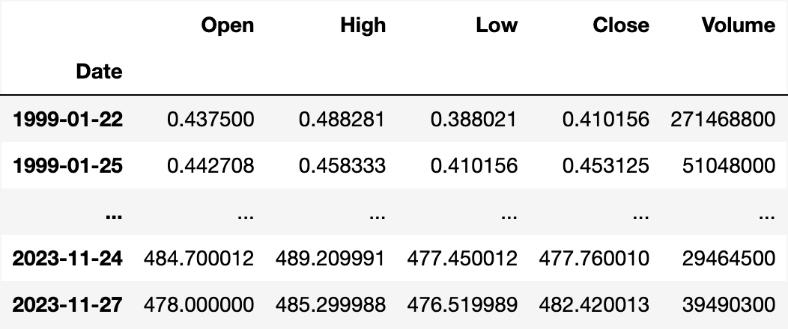
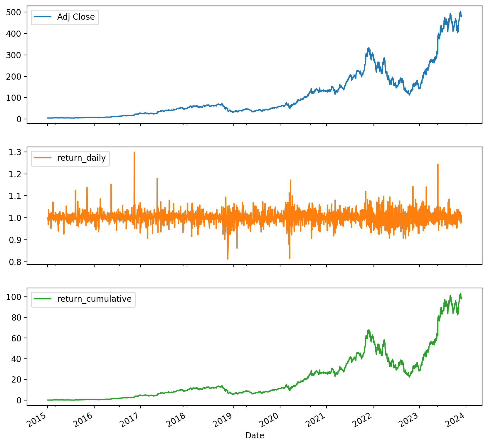
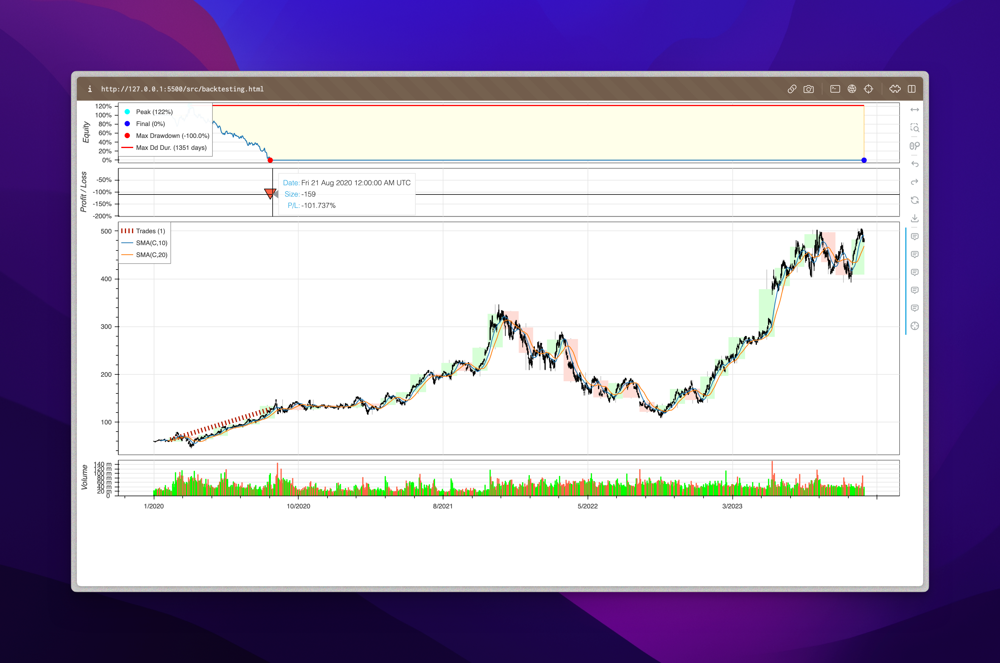

# Algorithmic Trading Basics with Python

This repository contains the materials of the workshop Algorithmic Trading Basics with Python, produced by [Datons Academy](https://maven.com/datons-academy).

You'll learn and practice the Python code to:

## 1. Download Stock Market Data

## 2. Calculate Returns

## 3. Submit Order to Broker

Using Python code with the [Alpaca API](https://alpaca.markets/docs/api-documentation/):

## 4. Create & Backtest Trading Strategy

